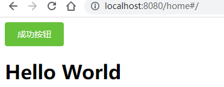
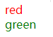

# web-vue2.md

## Node安装、npm换源、npm升级、vuecli全局安装

这部分忽略了

## 初始化项目

初始化项目

```
vue init webpack web-vue2
```

切换目录

```
cd web-vue2
```

启动项目

```
npm start
```

chrome访问localhost:8080 查看项目是否成功

## 安装vue router

新建 components/LeftMenus.vue 

```vue
<template>
  <div>
    <h1>Hello World</h1>
  </div>
</template>

<script>
export default {

}
</script>

<style>

</style>
```

安装vue router

```
npm install vue-router
```

新建 router目录

新建 router/index.js

```js
import Vue from 'vue'
import Router from 'vue-router'

import LeftMenus from '../components/LeftMenus'

Vue.use(Router)

const router = new Router({
    routes: [{
        path: '/',
        name: 'home',
        component: LeftMenus
    }]
})

export default router;
```

main.js 上挂载router

```
import Vue from 'vue'
import App from './App'
import router from './router'

Vue.config.productionTip = false

/* eslint-disable no-new */
new Vue({
  el: '#app',
  router,
  components: { App },
  template: '<App/>'
})
```

 app.vue  挂载路由

```vue
<template>
  <div id="app">
    <router-view></router-view>
  </div>
</template>

<script>


export default {
  name: 'App',
  components: {

  }
}
</script>

<style>

</style>
```

## 安装ElementUI2

[element ui doc](https://element.eleme.cn/#/zh-CN/component/installation)

```
npm i element-ui -S
```

引入element（全局引入）

main.js增加如下内容：

```js
import ElementUI from 'element-ui';
import 'element-ui/lib/theme-chalk/index.css';
Vue.use(ElementUI);
```

修改components/LeftMenus.vue 

```vue
<template>
  <div>
    <el-button type="success">成功按钮</el-button>
    <h1>Hello World</h1>
  </div>
</template>
```

查看结果



## 安装less

安装依赖包

注意：请使用less-loader@5安装less-loader 5.0.0版本，最新版本在vue2中可能无法使用，会报错哦

```
npm install less less-loader@5 --save-dev
```

找一个组件中添加如下内容测试：

```vue
<template>
	<div class="test1">
    red
    <div class="test2">green</div>
    </div>
</template>

<style lang="less" scoped>
.test1{
  color: red;
  .test2{
    color:green;
  }
}
</style>
```



## 404页面设置方法

新建 notFound.vue

```vue
<template>
<div>
    <el-empty :image-size="200" image="https://shadow.elemecdn.com/app/element/hamburger.9cf7b091-55e9-11e9-a976-7f4d0b07eef6.png" description="404喽"></el-empty>
</div>
</template>
```

路由index.js设置最后添加如下内容：

参考链接：[vue设置404页面](https://blog.csdn.net/przlovecsdn/article/details/81509843)

```js
{
    path: "/404",
        name: "notFound",
            component: notFound
}, {
    path: "*", // 此处需特别注意置于最底部
        redirect: "/404"
}
```

## 安装vuex

安装

```
npm i vuex -s
```

新建store文件夹

新建 store/models/menus.js

```js
const menus = {
  state: {
    test: "hello",
    data: [{
      span: "Element",
      subMenu: [
        {
          span: "NavMenu 导航菜单",
          url: "element\/navMenu"
        }
      ]
    }
    ]
  }
}
export default menus;
```

新建 store/index.js

```js
import Vue from 'vue'
import Vuex from 'vuex'
import menus from './models/menus'

//挂载Vuex
Vue.use(Vuex)

//创建VueX对象
const store = new Vuex.Store({
  modules: {
    menus,
  }
})

export default store
```

修改main.js

```js
import store from './store' 

new Vue({
  el: '#app',
  router,
  store, // 新增
  components: { App },
  template: '<App/>'
})
```

取值测试

```js
this.$store.state.menus.test
```

## 根据配置生成动态菜单

修改menus.js如下：

```js
const menus = {
  state: {
    data: [{
      span: "Element",
      subMenu: [
        {
          span: "NavMenu 导航菜单",
          url: "element\/navMenu"
        }
      ]
    }
    ]
  }
}
export default menus;
```

修改leftMenu.vue如下：

```vue
<template>
  <div>
    <el-row class="tac">
      <el-menu
        class="el-menu-vertical-demo"
        background-color="#545c64"
        text-color="#fff"
        active-text-color="#ffd04b"
      >
        <el-submenu
          v-for="(item1, index1) in $store.state.menus.data"
          :index="index1"
          :key="index1"
        >
        <!-- :key="index" 不加，会报错 -->
          <template slot="title">
            <i class="el-icon-eleme"></i>
            <span>{{ item1.span }}</span>
          </template>
          <el-menu-item-group v-if="item1.subMenu.length != 0">
            <el-menu-item v-for="(item2, index2) in item1.subMenu" :index="index1 + '-' + index2" @click="toMenu(item2.url)" :key="index2">
              {{item2.span}}
            </el-menu-item>
          </el-menu-item-group>
        </el-submenu>
      </el-menu>
    </el-row>
  </div>
</template>

<script>
export default {
  data() {
    return {};
  },
  methods: {
    test() {},
    toMenu(value) {
      switch (value) {
        case "element\/navMenu":
          this.$router.push("/index");
          break;
        case undefined:
          console.log("in 404");
          this.$router.push("/404");
          break;
      }
    },
  },
};
</script>

<style>
</style>
```

修改home.vue

```vue
<template>
  <div class="home">
    <el-container>
      <el-aside>
        <left-menu></left-menu>
      </el-aside>
      <el-container>
        <el-main>
          <router-view></router-view>
        </el-main>
      </el-container>
    </el-container>
  </div>
</template>

<script>
import leftMenu from "./leftMenu.vue";
export default {
  components: { leftMenu },
};
</script>

<style lang="less" scoped>
.el-aside {
  background-color: gray;
  color: black;
  width: 10%;
}
</style>
```

